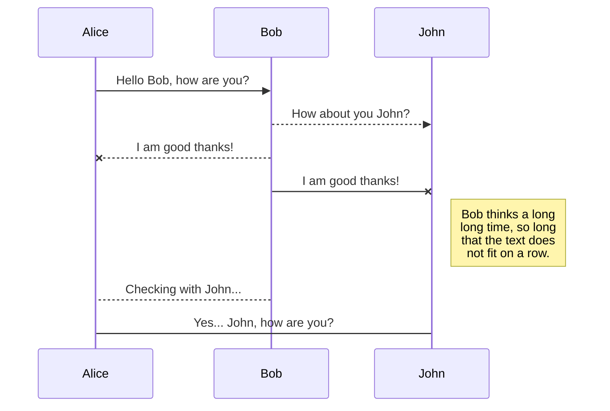

## Terminology

protocol conformance
: The set of witnesses used to satisfy the requirements of a given protocol.

<block style="color:blue;"> 
A protocol specifies a set of requirements.  A protocol may be applied to any type that satisfies its protocol requirements.  
</block>

A protocol also may supply functionality, which may serve as default implementations of its own protocol requirements.  A protocol provide may provide additional functionality of an arbitrary nature.  

Most powerfully, a protocol may serve as the basis for an existential type bearing the same type name as the protocol, with the interface of the existential type being defined by the protocol.

## 1. Protocol Conformance
With respect to a type declared to conform to a protocol, a protocol conformance specifies, for each protocol requirement of the protocol, which property, method, initializer, subscript or typealias will be used to implement the protocol requirement when invoked on the type.  Understanding protocol conformance is key to obtaining predictable polymorphic behavior.  This guide explains the semantics of how Swift determines a protocol conformance.


#### Declaration of Protocol Conformance
For a type `t` to conform to a protocol `p`, `t` must be declared to conform to `p`, and `t` must have at least one unconditionally accessible implementation for each protocol requirement of `p`.  A declaration that `t` conforms to `p` further constitutes, with respect to each protocol `o`*<sub>i</sub>* from which `p` directly or indirectly inherits, a declaration that `t` conforms to `o`*<sub>i</sub>* so long as `t` has not already been declared to conform to `o`*<sub>i</sub>*.   

In a given scope, a type may not be declared to conform to a protocol if a declaration of the conformance of the same type to the same protocol is visible in the scope.  In a given scope, a type can conform to a protocol in only one way.  This rule holds true even where competing declarations are conditional with disjoint conditions.  
  
#### Protocol Witness
Given a protocol `p`, a *protocol requirement* `m` is a statement in the declaration of `p` that describes a member, such that, as a condition of a type `t` being able to conform to `p`, `t` must have a member satisfying the requirements of `m`.  A member of `t` that satisfies the requirements of `m` is referred to as an *implementation* of `m`.  

If `t` is declared to conform to `p`, then, for protocol requirement `m` of `p`, one and only one of `t`'s  implementations of `m` will actually be used as the implementation of `m`.  Such implementation of `m` is referred to as the *protocol witness* for the `m` requirement of the conformance `t: p`.  A protocol witness exists with respect to a given protocol requirement of a given declaration of conformance of a type to a protocol.

A type may have more than one implementation of a given protocol requirement.  If a type has only one *unconditionally available* implementation of a given protocol requirement, then that implementation will be the protocol witness.  If a type has more than *unconditionally available* implementation of a given protocol requirement, then the *most specialized* of those implementations will be the protocol witness.

Given a declaration that a type conforms to a protocol and a protocol requirement of the protocol, the ***protocol witness*** for such protocol requirement is the most specialized implementation from among the implementations that are unconditionally accessible on the type.

&#9724; unconditionally accessible implementation
: Given a declaration that a type conforms to the protocol, the scope in which such declaration is stated, and an implementation of a protocol requirement of the protocol, the implementation is unconditionally accessible if and only if (i) the conditions of any generic where clause to which the declaration of the implementation is subject are satisfied, and (ii) per the rules of access control, the implementation is visible in the scope.
  * With respect to a type that is a concretization of a generic type, this rule is not fully implemented; although the type that is a concretization  may fully satisfy the conditions of a where clause stated on the generic type, implementations subject to such conditions remain unavailable to serve as protocol witnesses.
  * ~~Similarly,  this rule is not fully implemented, in the case of implementations declared in protocol extensions that are subject to the conditions of a generic where clause tied to `associated type` requirements of the protocol.  Regardless of whether the conditions are satisfied, implementations subject to such conditions remain unavailable to serve as protocol witnesses.~~[check this]

&#9724; degree of specialization
: Given multiple implementations of the same protocol requirement, the degree of specialization of an implementation is based on the declaration of the implementation, as follows, from most specialized to least specialized: [check this]
  1. conditionally declared in an extension of the type;
  2. unconditionally declared in the declaration or an extension of the type;
  3.  conditionally declared in an extension of a protocol to which the type conforms; and
  4. unconditionally declared in an extension of a protocol to which the type conforms. 

  * If multiple protocols in a chain of inheritance of protocols provide declarations of an implementation, the implementation on a more refined protocol is more specialized than an implementation on a less refined protocol. [check this]
  * Where multiple protocols outside of a single chain of inheritance provide implementations, an ambiguity error occurs. [check this]

&#9724; protocol requirements set
: The set of requirements declared within the declaration of a protocol.  

&#9724; protocol witness set
: Given a declaration that a type conforms to a protocol, the protocol witness set is the set consisting of the protocol witness for each declared requirement of the protocol.  [A protocol witness set also is referred to as a protocol conformance.  I am suggesting this term to avoid ambiguity between that usage of the term protocol conformance and similar usage of the term to refer to the more general notion that a type is declared to conform to a protocol or that a type has implementations capable of conforming to a protocol.  I also am suggesting that the termprotocol witness set presents a much better conceptual picture of what the conformance actually is.]
  * There is only one protocol witness set for a protocol conformance declaration.  Such set is immutable, and is not subject to replacement.
  * If a protocol has no declared requirements, the protocol witness set for conformances to the protocol is empty.
  * Inherited requirements of a protocol are irrelevant to determination of a protocol witness set.
  


&#9724; accessible member
: Given a type in a scope, a member of the type is accessible if, per the rules of access control, the member is visible in the scope.


&#9724; protocol requirement
: Given a protocol, a ***protocol requirement*** is a statement in the declaration of a protocol that describes a member that a type must have as a condition of being able to be declared to conform to the protocol.

  * This is my laration of a protocol that describes a member that a type must have as a condition of being able to be declared to conform to the protocol.
   


&#9724; member of a type
: A property, method, initializer, typealias or enum case is a member of a given type if it is declared in any of:  the declaration of the type, any extension of the type, or any extension of any protocol to which the type conforms.
[types have other members; ]


&#9724; declared requirement
: Given a protocol `Q`, a protocol requirement declared within the declaration of `Q`. 

&#9724; inherited requirements
: Given a protocol `Q` that inherits from a protocol `P`, all protocol requirements of `P`. 


### 1.1 The Witness
If a type is declared to conform to a protocol, the type must satisfy each of the protocol requirements of the protocol.  The type does so by having available at least one implementation--that is at least one property, method, initializer, subscript or typealias--for each protocol requirement of the protocol.  

With respect to the a type that is declared to conform to a protocol, for each protocol requirement of the protocol, Swift determines the one and only implementation that will be used throughout a program to satisfy that protocol requirement for that type.  The implementation so determined is referred to as the witness for the protocol requirement.

&#9724; witness
: The particular implementation used to satisfy a protocol requirement.

The purpose of a protocol conformance is to define which witness will be accessed when a given protocol requirement is accessed.

### 1.3 Underpinnings of Protocol Conformance

#### 1.3.1 Singular
A protocol conformance is determined with respect to the pairing of a type and a protocol to which it conforms. A type may conform to a protocol in one and only one way.  There cannot be more than one protocol conformance for a type-protocol pairing.  

&#9724;   It is an error to twice declare the conformance of a type to a given protocol.  The same is true even if the conformances are conditional with disjoint conditions.

If a type conforms to multiple protocols, there will be a distinct protocol conformance for each type-protocol pair.

#### 1.3.2 Immutable
A protocol conformance is immutable.  It cannot be altered by operation of a program.  

#### 1.3.3 Invariant
Within a given protocol conformance, the witness for a particular protocol requirement will not vary during operation of a program, and does not depend upon how the type is used.

&#9724;   In complex arrangements, it may be perceived that the witness varies.  Sometimes, this appearance is due to two different protocols being used, with the protocols having the same requirement but different witnesses for the requirement.  *See*, §__.  Other times, this appearance is due to complexity making it difficult to reason about which implementation is the witness for a protocol requirement.  *See*, §___. [^1]
[^1]: Could simulated variation also be due to overloading?

#### 1.3.5 Inferred
The declaration that a type conforms to a protocol is expressly stated. But the protocol conformance underpinning that declaration is neither declared nor guided by annotation.  Instead, Swift infers the protocol conformance through analysis of all possibly available implementations of a protocol requirement.

#### 1.3.6 Possibly Available Implementations
In a simple case, there may exist only one possible implementation for each protocol requirement of a protocol.  In that case, determining the protocol conformance is a simple matter of matching each requirement with its implementation.  

In more complex cases, there may be numerous implementations available for each protocol requirement.  Implementations may be scattered across multiple files of the module, in the source code and binary files of imported modules, or in the Standard Library.

&#9724;   Engineering a protocol conformance requires careful attention to detail.  It would not be unusual for a small change, far from the point of declaration, to significantly alter a protocol conformance.

Possibly available implementations may be declared in any of the following whether within the same module or in a module imported into the file in which the subject type is declared to conform to the subject protocol:
1. the declaration of the subject type,
2. a visible extension of the subject type,
3. the declaration of a superclass of the subject type,  [check this]
4. a visible extension of a superclass of the subject type,
5. a visible extension of another protocol lower in the subject protocol’s chain of protocol inheritance to which lower protocol the subject type also conforms,
6. a visible extension of the subject protocol,
7. a visible extension of another protocol higher in the subject protocol’s chain of protocol inheritance,
8. a visible extension of 

In this case, visible means _____.

#### 1.3.7 Implicit Conformance
As discussed in the general documentation of protocols, if a type is declared to conform unconditionally to a protocol, that declaration also acts as an implicit declaration that the type conforms to all other protocols from which the protocol directly or indirectly inherits.


#### 1.3.7 Accessible Implementations
With respect to the declaration that a type conforms to a protocol, an implementation of a protocol requirement is visible if, at the point of the declaration, the implementation is an accessible member of the type, whether declared on the type, any superclass from which the type inherits, or *any* protocol to which the type is expressly or implicitly declared to conform.  


[, with the access level of the implementation being no more restrictive than the access level of the protocol.]
[Is it necessary to caveat the access level?  Is the caveat correct?]  
[what about impls declared on a protocol that a superclass of the type conforms to?]


#### 1.3.7 Implementations in Line of Inheritance
With respect to a type declared to conform to a protocol, 

With respect to a protocol that inherits from another protocol, the junior protocol has access to all of the implementations available to the senior protocol, including those accessible to the senior protocol by way of inheriting from yet another protocol.  As a result, a protocol that inherits from another protocol will have access to all implementations declared in the line of inheritance, running from the senior-most protocol to the subject protocol.
By contrast, a senior protocol in an inheritance relationship with a junior protocol does not have access to the methods     

#### 1.3.8 Conflicting Implementations
With respect to a protocol requirement, it is a compile-time ambiguity error if multiple accessible implementations exist and not all such implementations belong to the same line of protocol inheritance.  The compiler does not attempt to resolve the ambiguity.

&#9724; line of protocol inheritance
: [insert a definition]

#### 1.3.8 Relative Specialization of Implementations
With respect to a declaration that a type conforms to a protocol, as between any two implementations of a protocol requirement, an implementation is the more specialized implementation if it is declared on the type or on a superclass of the type or on a protocol that is more refined than the protocol on which the other implementation is declared.  See, §__ re: refinement of protocols.
  


#### 1.3._ Provisional Validity Assumption


### 1.4 Interaction with Class Inheritance

Where a class conforms to a protocol, the nature of class inheritance impacts the availability of implementations for purposes of protocol conformance.  For instance, a superclass may expose functionality that incidentally has the same signature as a protocol requirement.  Conversely, if a class is declared to conform to a protocol, the implementations in a subclass of the class are not available to satisfy the protocol requirements.

### Invocation
At point of invocation, which protocol's protocol requirement is being invoked?
Whether invoked at all--or concrete method on concrete type is called.


### Signature Matching

Protocol requirements and implementations are matched based on _____.  [check this]  Member names, argument labels, parameter order, parameter types, return types, etc., must be the same.  Parts that are not part of the signatures, such as parameter names, are disregarded for matching.

A type may satisfy the protocol requirements  of a protocol using functionality declared as part of the protocol itself, the type itself, a superclass from which the type inherits, or any other protocol to which the type conforms.

As there may be multiple independently-scoped contexts from which a given type may satisfy the protocol requirements of a given protocol,  multiple implementations  of a given protocol requirement may be available to the type.  The selection of which implementations available to a type will be used to satisfy the protocol requirements of a protocol is referred to as the  protocol conformance  for the type to the protocol.

A protocol conformance is the abstract concept of the behavior of a given protocol when conforming to a given type in the presence of a given set of other protocols, if any, to which the type also conforms.  All representations of that concept are implementation details internal to Swift.  Any difference in a protocol’s behavior from one context to the next is detectable only by the difference in state and/or side effects that result when the system chooses one implementation of a particular requirement or arbitrary functionality over another.

Fundamentally, a protocol is a collection of abstract behaviors, specified via  protocol requirements.  A protocol may include  default implementations  of its protocol requirements, which implementations may be concrete or generic in their operation.  Further, a protocol may include additional,  arbitrary functionality[define a term for this…].  A protocol’s protocol requirements, default implementations and arbitrary functionality, together, define a potential  range of behavior for the protocol.  The actual available behavior of a protocol within its potential range varies depending upon what type is conformed to the protocol and depending upon what other protocols are conformed to that type.  The actual available behavior is the protocol conformance.

A protocol conformance is the abstract representation of the behavior of a given protocol when conforming to a given type.  When a given type conforms a given protocol, the type forms a relationship with the protocol.  The behavior of the protocol in the context of that specific relationship is referred to as a  protocol conformance.  When a type conforms to multiple protocols, each type-protocol relationship in that arrangement constitutes a distinct protocol conformance.  The presence of any given protocol in an arrangement may affect the behavior of one or more other protocols in the arrangement such that a protocol conformance should be regarded as being specific to the arrangement.  Thus, a protocol conformance cannot safely be assumed to apply to a different arrangement of a type and protocols.

EXAMPLE


## Basic Rule of Protocol Conformance
The basic rule of protocol conformance is stated, as follows:
>For a given protocol requirement, the ***most specialized implementation*** that is  ***available to the protocol via the conforming type*** will be selected as the witness.

Protocol conformance involves matching each protocol requirement of a protocol to an implementation of the requirement.  For a given protocol requirement, multiple implementations may be present.  An implementation selected by protocol conformance is referred to as a  witness.  The  most specialized implementation of a protocol requirement that is  available to the protocol  will be selected as the witness for the protocol requirement.

Protocol conformance results in a set of requirement/witness pairings for the conformance of a given type to a given protocol:  one witness for each protocol requirement.  That set is referred to as a  protocol witness table.  The concept of the protocol witness table is an implementation detail, not visible to the user.  Nonetheless, the idea of the protocol witness table may help inform a user’s mental model of protocol conformance and what it produces.

Protocol conformance is performed at compile time.  Its results are not altered by conditions at run time.

**Associatedtype Requirements**

**Most Specialized Implementation**

A candidate implementation may be declared in any of the following:

1. the declaration or an extension of the subject type,

2. the declaration or an extension of a superclass of the subject type.  [check this]

3. an extension of another protocol lower in the subject protocol’s chain of protocol inheritance to which lower protocol the subject type also conforms,

4. an extension of the subject protocol, or

5. an extension of another protocol higher in the subject protocol’s chain of protocol inheritance.

The  most specialized implementation  is the candidate implementation closest in relationship to the subject type.  The listing, above, of possible sources of an implementation is listed in closeness of relationship to the subject type, beginning with the subject type itself.

EXAMPLES (simple and complex)

**Available to the Protocol**

With respect to a protocol, an implementation is  available to the protocol  if it visible within the scope of the subject type under all relevant conditions.  The scope of the subject type includes all protocols to which the type is declared to conform.  [check this] If an implementation is unconditionally declared, it is available under all conditions.  If an implementation is declared in an extension qualified by a generic where clause, the implementation is available only under the conditions stated in the generic where clause.  If the conditions applicable to a conditionally-declared implementation are not identical to the conditions under which the protocol conformance is stated to exist, the implementation is deemed unavailable.  The compiler does not attempt to reconcile one set of conditions with another to determine whether the conditions to a protocol conformance might be a subset of the conditions to the declaration of an implementation; instead, the compiler simply rejects the implementation.  [check this]

EXAMPLE

**Interdependent Protocol Conformance**

The protocol conformance of a type to a protocol is determined with the provisional assumption that all declarations of the type conforming to other protocols are valid, and so any additional functionality provided by those other protocols is assumed to be available to the subject protocol.  Thus, if the requirement of one protocol is satisfied by additional functionality of another protocol, and vice versa, the protocol conformance will be valid as to both protocols.

**Protocol Conformance for a Generic Type**

If a type is generic, the protocol conformance is performed with respect to the type in its general form.  If an implementation of a protocol requirement is declared in an extension of a generic type that is constrained by a type parameter of the generic type, that implementation is disregarded for purposes of protocol conformance.  [check this]

EXAMPLE

**Conditional Conformance**

If a type is declared to conditionally conform to a protocol, the protocol conformance is performed with the conditionality taken into account.

If an extension of a protocol in a protocol hierarchy declares an implementation for a requirement of a protocol higher in the hierarchy, that implementation will be available to satisfy the higher protocol’s requirement only when a the type conforms to the lower protocol.  If the type’s conformance to the lower protocol is conditional and the conformance to the higher protocol is unconditional or differently-conditioned, then, per the rules of implementation availability discussed, above, the implementation declared on the lower protocol will be regarded as unavailable for protocol conformance for the higher protocol.  An implication of such unavailability is that, even though the specialized behavior is present in the hierarchy, it will not be available to the conditionally conforming type—not even when the condition to the conformance to the lower protocol is satisfied.

EXAMPLE

Where a type is declared to conform to multiple protocols that exist in an inheritance relationship, protocol conformance is performed beginning with the protocol lowest in the hierarchy (i.e. the most specialized).  The protocol conformance is determined for all protocol requirements declared by such protocol, if any.  Note that the restatement of a requirement of a protocol higher in the hierarchy is meaningless, and so is disregarded (but does not generate a warning or error).  Then, the protocol conformance is determined for the protocol from which the lowest protocol directly inherits, with that protocol conformance being determined for all protocol requirements declared by such protocol, if any.  The process proceeds until protocol conformance for the highest protocol in the hierarchy is complete.  [check this]  [all of this is a giant implementation detail; not relevant, here]

If multiple branches of a protocol hierarchy are involved, the process will begin with the lowest descending branch, and then proceed to the next lowest descending branch, and so on.  [check this] once the protocol conformance of a protocol in the hierarchy is determined while processing a branch, that same protocol conformance will be used in all subsequent branches.  It will not be redetermined.  In that fashion, a type will conform to any given protocol in one, and only one, way.  Thus, there will only be one protocol conformance for the combination of a given type and protocol.  [annotation re: multi-module issue] [annotation re: specializations unavailable due to conditionality]

If a type conforms directly to multiple protocols or a protocol inherits directly from multiple protocols, the order in which protocol conformance is performed is as follows: ____.

Once determined, it is encoded into a program’s binary representation.  A  protocol conformance  is not directly inspectable via tooling.

Conditionally available …

One and only one

Module scope

Static dispatch of non-required implementations….

Invocation ...  whether the invocation is directly on an instance of the type or through an existential container holding an instance of the type.   


Another key factor to understand is whether a given call actually invokes the protocol system, which factor is discussed at ____, below.

(or a set of protocols in an inheritance relationship)

Concrete invocations…

Shadowing...

However, it should be noted that such an implementation nevertheless will be available on an instance of the concrete type, and if the name of the implementation is called on such instance, the call will be dispatched to the implementation declared in the constrained extension of the generic type; such implementation is said to shadow the protocol requirement.  When a shadow implementation is called, the protocol system effectively is not involved in the dispatching, although, from the user’s perspective, the net effect is the same as if the shadow implementation had been selected via protocol conformance.

Protocol inheritance from a class

A type cannot re-conform to a protocol in varying ways inside the same module

Annotations:

[copy more from thread]

[discuss subtleties and surprises]

[discuss Collection hierarchy’s special behavior]

[describe implementation departures from intended system]

[describe known bugs]

[no implicit override]

[no override at all]

[At the implementation level, that set of pairings is called a protocol witness table.]

[annotate re: leakage of imported protocols beyond the file in which the import occurs]

[test harness to ensure desired protocol conformance]

[https://forums.swift.org/t/protocol-witness-matching-mini-manifesto/32752]

### 1.1c Model of a Protocol Conformance
With respect to the declaration that a type conforms to a protocol, the protocol conformance is a collection containing the witness for each protocol requirement of the protocol.
 
&#9724;   Metaphorically, a protocol conformance may be modeled as an immutable struct containing a declaration that a type conforms to a protocol and a dictionary of protocol requirement-witness pairs:
```swift
struct ConformanceDeclaration {
	let type: Type // must be a struct, enum or class
	let protocol: Type // must be a protocol
}

struct ProtocolConformance {
	let declaration: ConformanceDeclaration
	let witnesses: [ProtocolRequirement: Witness]
	
	init(/* the entire visible context */) {
		// See §1.4 of this guide
	}
}
```


## Which Protocol Conformance?
At the point where a protocol requirement is accessed on a conforming type, there may exist more than one protocol to which the type conforms that carries the ability to access the protocol requirement.  Typically, th

Single possibility case...


For example:
```swift
protocol P {
  var id: String { get } // << Point #1
}
extension P {
  var id: String { "P" } // << Point #2
  var id2: String { self.id } // << Point #3
}

protocol Q: P {}
extension Q {
  var id: String { "Q" } // << Point #4
}

protocol R: P {}
extension R {
  var id: String { "R" } // << Point #5
}

struct Y<T> {}
extension Y: P {
  var id: String { "Y1" } // << Point #6
}
extension Y: Q where T: Equatable {
  var id: String { "Y2" } // << Point #7
}

let y = Y<Int>()

print(y.id2) // "P", "Q", "R", "Y1" or "Y2"? 
```
Protocol `P` declares its sole protocol requirement, `id: String { get }`, at Point #1.  Protocol `Q` inherits from protocol `P`, but has no protocol requirements of its own. Protocol `R` inherits from protocol `P`, but has no protocol requirements of its own.

Struct `Y<T>` is unconditionally declared to conform to `P`, and is conditionally declared to conform to `Q`.  Two protocol conformances are formed, one for `Y: P` and one for `Y:Q`. 

Five implementations of `id: String { get }` are present in the source code.

The instance `y` of `Y<Int>` conforms to both `P` and `Q`.   The `id2` getter declared in the extension of `P` is accessed via `y`. 


but only four of those implementations are possibly visible implementations with respect to each of `Y: P` and `Y:Q`. 
<!--stackedit_data:
eyJwcm9wZXJ0aWVzIjoiZXh0ZW5zaW9uczpcbiAgcHJlc2V0Oi
AnJ1xuIiwiaGlzdG9yeSI6WzE3NzQ3MzgyMTIsMTc0MzUwOTky
NCwxMjEzNTAxNDkyLDUzNzU3MjUxNiwxMTM3OTYwMzM5LDE2OD
YzMTAxMjksLTE5NTMwMTUyMSwxNjA5ODg3MDA1LC04NTM2MzE3
MzMsLTMwNTcyNTIxOCwtNzI4MzcxNzc3LDg0MzU4MDgwOCwxMj
U2MzEwNjI2LDEyMzU5NTE0MSwtMjAzNDk3MjI5MCwtMTA0Nzkx
MTQwOSwtOTI4ODQ4Njk1LDE2NTYzNzUwMDcsLTE0MTA1NjEyMj
MsLTQ2NTEwMDA0OV19
-->